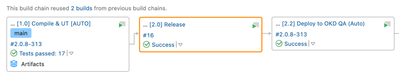
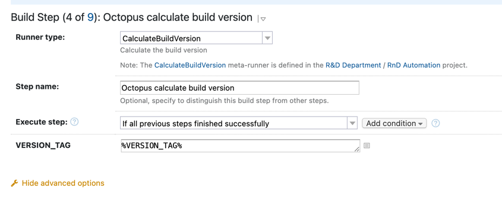
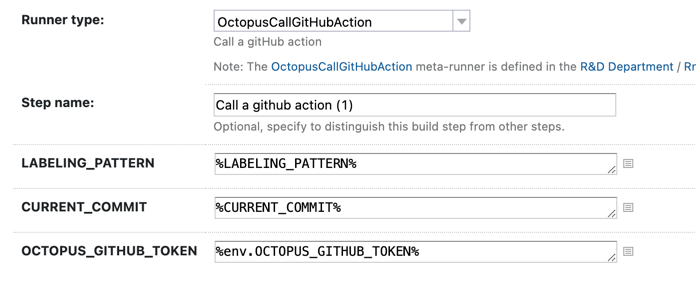

# Meta-runners

There are some common steps in the configurations.
They have been grouped by the configurations where they can be used.

- [Read a latest version from tag](ReadVersionFromLatestTag.xml) - read the latest tag(by mask v(0-9).(0-9).(0-9)) from current Git repository and write it to the variable VERSION_TAG, also write a commit hash into CURRENT_COMMIT
- [Calculate octopus build version](CalculateBuildVersion.xml) - parse a input variable VERSION_TAG with a special format (v{versionMajor}.{versionMinor}.{versionPatch}.{buildCounter}) and increment the patch version. The result is written into the PROJECT_VERSION with the format '$versionMajor.$versionMinor.$versionPatch' and into the variable buildNumber with the format $versionMajor.$versionMinor.$versionPatch-$buildCounter
- [Call GitHub action](OctopusCallGitHubAction.xml) - execute a gitHub action remotely. LABELING_PATTERN - the build version(exemple: v0.0.0), CURRENT_COMMIT - the commit hash

---
# Pipe-line

## Keycloak

Add an ADMIN role to the user roles

## Vault

Add the new keys to ***'config-server / api-gateway-cloud-qa / api-gateway-cloud-qa / spring.security.oauth2.client.registration.keycloak.client-secret'*** and ***'config-server / api-gateway-cloud-qa / api-gateway-cloud-prod / spring.security.oauth2.client.registration.keycloak.client-secret'***

## Pipeline for Employee-service

### Global project parameters

These parameters should be defined at the aggregator project level.

- Define a new parameter OCTOPUS_GITHUB_DOCKER_REGISTRY to set a docker registry path where a docker image is retained(ghcr.io/octopusden)
- Set up Docker Registry for proxying from the external hosts (docker.io and ghcr.io)

### Local project parameters

| ***Name***                                           | ***Value*** |
|------------------------------------------------------|-------------|
| RELENG_SKIP                                          | true        |
 | GRADLE_RELEASE_MANAGEMENT_PLUGIN_VERSION_ARTIFACTORY | 2.0.2       |

### 1. Compile && UT

1. Add a new step that is based on the meta-runner '[Read current tag](../teamcity.meta-runners/ReadVersionFromLatestTag.xml)' after the step **'Compile & UT'**
2. Add a new step that is based on the meta-runner '[Octopus calculate build version](../teamcity.meta-runners/CalculateBuildVersion.xml)' after the step **'Read current tag'**. Need to set a value in to the parameter VERSION_TAG as '%VERSION_TAG%'
   
3. Futhere perform a standard sequence of the steps such as ex Check Component Configuration in JIRA before Build, Build and etc

#### Environment Variables

| ***Name***                | ***Description***                                  |
|---------------------------|----------------------------------------------------|
| env.AUTH_SERVER_REALM     | The name of the realm of Keycloak.                 |
| env.TECHNICAL_USER_BEARER | The security token which was created in Keycloak.  |

---
### 2. Release

1. Set LABELING_PATTERN which was received from [Read current tag](../teamcity.meta-runners/ReadVersionFromLatestTag.xml) as the version from the tag
2. Set CURRENT_COMMIT which was received from [Read current tag](../teamcity.meta-runners/ReadVersionFromLatestTag.xml)
3. Set OCTOPUS_GITHUB_TOKEN to access to GitHub

### 3. Deploy

Disable step 'Close Deployed Issues'

| ***Name***        | ***Value***                                                                               |
|-------------------|-------------------------------------------------------------------------------------------|
| HELM_SERVICES_SET | --set image.name=octopusden/employee-service-staging --set image.tag=%PROJECT_VERSION%... |
| PROJECT_VERSION   | %CompileUt.PROJECT_VERSION%                                                               |
